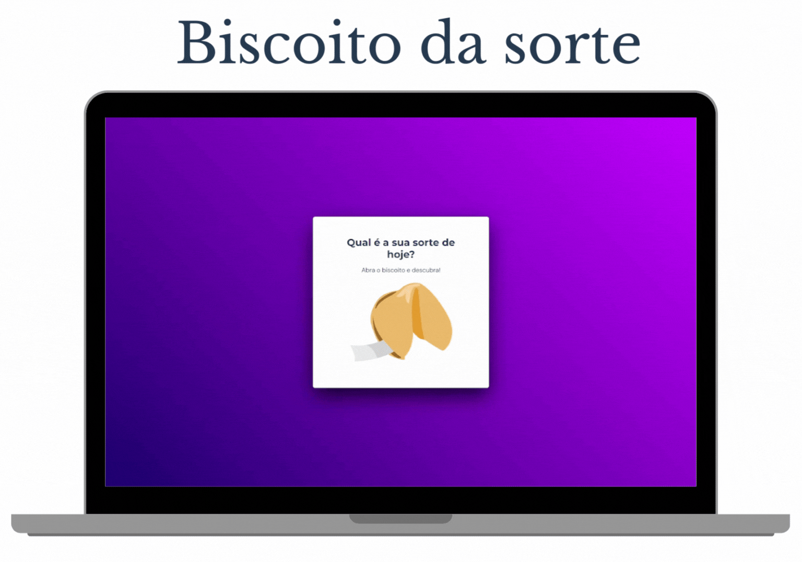

# Biscoito da Sorte Interativo

## Descrição

Este projeto, um encantador aplicativo web "Biscoito da Sorte", é um desafio do curso de programação da [Rocketseat ](https://www.rocketseat.com.br/), focado no módulo de JavaScript Avançado. A aplicação simula a experiência de abrir um biscoito da sorte. Ao passar o mouse sobre a imagem do biscoito, ele vibra para adicionar interatividade. Clicando no biscoito, ele se "abre", revelando uma mensagem surpresa. O projeto foi desenvolvido usando HTML, CSS e JavaScript.

## Demonstração

Veja o projeto em ação aqui: [Biscoito da Sorte](https://ismael-figueiredo.github.io/biscoito-da-sorte/)

## Tecnologias Utilizadas

- **HTML**: Estrutura da página.
- **CSS**: Estilização e animações.
- **JavaScript**: Lógica de interatividade e geração de mensagens aleatórias.

## Características

- **Animação de Vibração**: Uma animação de vibração é acionada ao passar o mouse sobre o biscoito, aumentando a interatividade.
- **Geração de Mensagens**: Clicando no biscoito, ele se "abre", revelando uma mensagem aleatória, similar à experiência de um biscoito da sorte real.

## Contribuições

Contribuições, sugestões e feedbacks são sempre bem-vindos! Para contribuir, siga estes passos:

1. Faça um Fork do projeto.
2. Crie uma Branch para sua Feature (`git checkout -b feature/AmazingFeature`).
3. Adicione suas mudanças (`git add .`).
4. Commit suas mudanças (`git commit -m 'Add some AmazingFeature'`).
5. Push para a Branch (`git push origin feature/AmazingFeature`).
6. Abra um Pull Request.

## Autor

Ismael Figueiredo

## Licença

Este projeto está sob  `LICENSE` MIT. 

---
